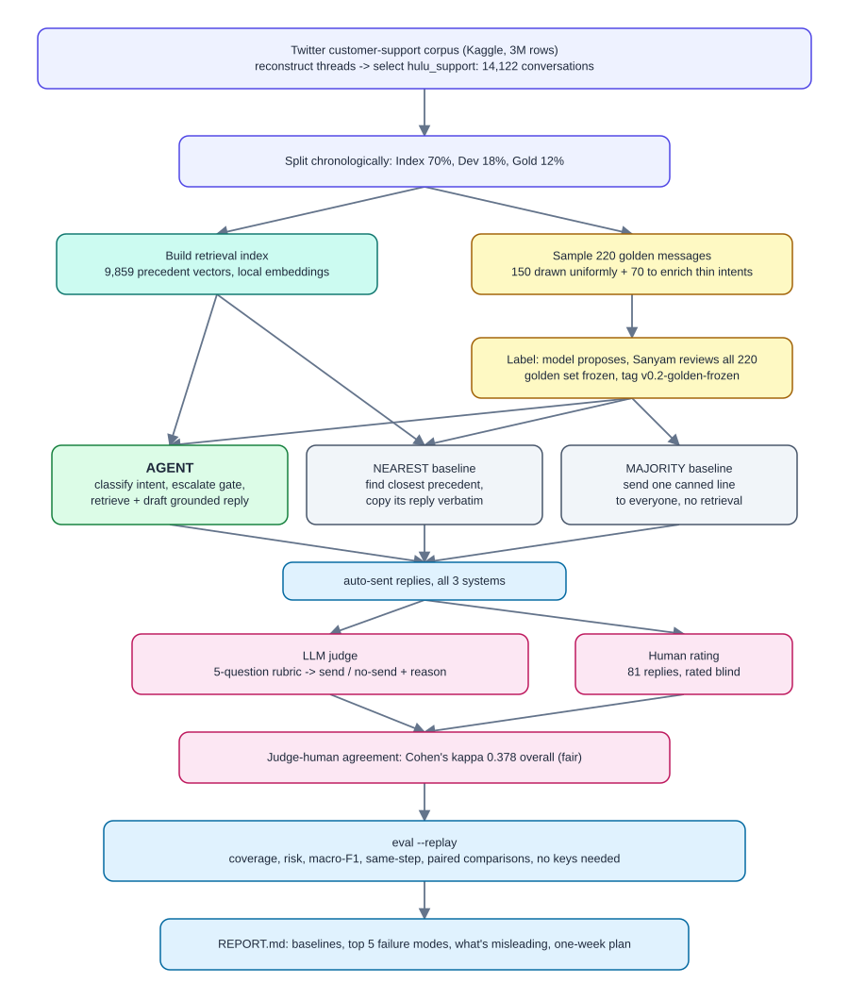

# brandbot

A customer-support agent for a single Twitter brand, and the evidence that it works.

Given an incoming customer message it does three things: classifies the intent against a
taxonomy induced from that brand's own history, drafts a reply grounded in how the brand
actually resolved similar issues, and decides whether to auto-send or escalate to a human.

Built for the Hiver SDE intern take-home. The brief's thesis is that the proof matters more
than the system, so most of the work here is in the evaluation.



## Reproduce the headline results

```bash
git clone https://github.com/SanyamWadhwa07/Brandbot.git
cd Brandbot
uv sync
uv run brandbot eval --replay
uv run pytest
```

No API keys, no network, no Kaggle account. Every metric is recomputed from committed model
outputs. See [docs/EVALUATION.md](docs/EVALUATION.md) for what `--replay` does and does not
re-derive.

## Where each deliverable lives

| Asked for | Here |
|---|---|
| Runnable pipeline, headline results in under 15 min | This README, `uv run brandbot eval --replay` |
| Golden set, 150-250 hand-labelled, with sampling note | `data/gold/golden.jsonl`, [docs/GOLDEN_SET.md](docs/GOLDEN_SET.md) |
| Automated metrics | [docs/EVALUATION.md](docs/EVALUATION.md) (Metrics) |
| LLM-as-judge rubric for reply quality | [docs/EVALUATION.md](docs/EVALUATION.md) (Rubric) |
| Evidence the judge agrees with a human | [docs/EVALUATION.md](docs/EVALUATION.md) (Judge validation) |
| Problem framing: what "good" means, what I did not build | [docs/REPORT.md](docs/REPORT.md) (section 1) |
| Results vs a trivial and a simple baseline | [docs/REPORT.md](docs/REPORT.md) (section 2) |
| Top 5 failure modes, real examples and hypotheses | [docs/REPORT.md](docs/REPORT.md) (section 3) |
| What is misleading about my headline number | [docs/REPORT.md](docs/REPORT.md) (section 4) |
| What I would do next with one more week | [docs/REPORT.md](docs/REPORT.md) (section 5) |
| Decision log, 10-15 non-obvious decisions | [docs/DECISIONS.md](docs/DECISIONS.md) |
| Citations for anything borrowed | [docs/REPORT.md](docs/REPORT.md) (section 6) |

## Status

Done. All eight deliverables have a first version, numbers included.

On the 220-message golden set, the agent auto-sends 29% of messages at a 6% held-back
rate (share a support lead would stop before it reached the customer), against 99%
auto-sent at 50% held-back for the nearest-neighbour baseline. Macro-F1 0.671 vs 0.450.
Both gaps clear the paired bootstrap noise floor. Full numbers, both baselines, and what
is misleading about all of it: [docs/REPORT.md](docs/REPORT.md).

The judge-human agreement the headline numbers depend on is fair, not strong: kappa
0.378 overall, and as low as 0.014 on the majority baseline. That qualifies every
risk figure above it. See [docs/REPORT.md](docs/REPORT.md) (section 4) before trusting a
number from this project.

## Data

Derived from [Customer Support on Twitter](https://www.kaggle.com/datasets/thoughtvector/customer-support-on-twitter)
by Stuart Axelbrooke. See `data/LICENSE` for terms covering the committed subsample.
